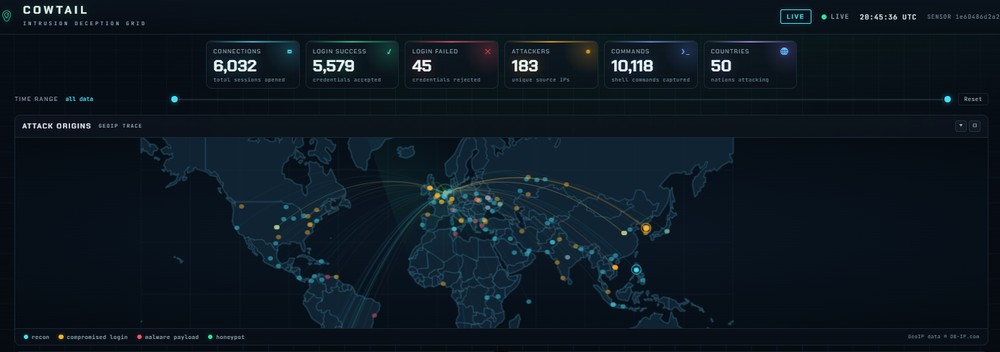
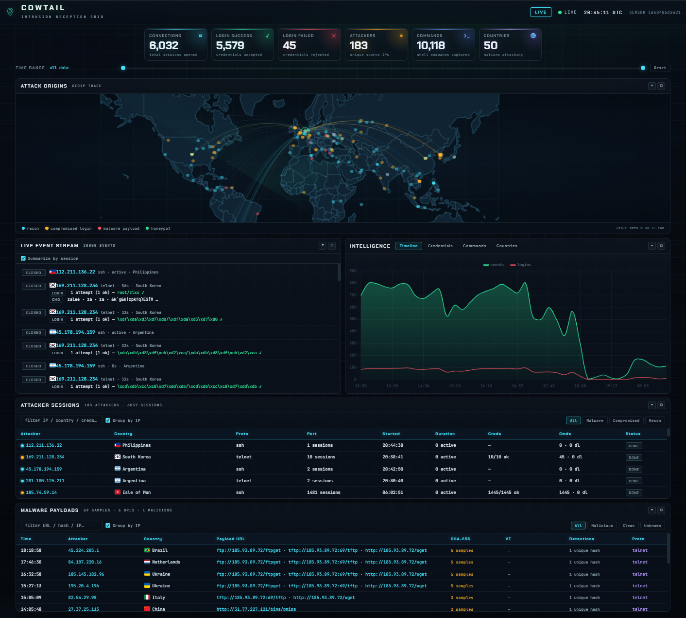

# Cowtail

A real-time, fully-offline web dashboard for the [Cowrie](https://github.com/cowrie/cowrie) SSH/Telnet honeypot. It tails your `cowrie.json` event log and streams it to the browser over WebSocket — no page polling, no auto-refresh, no internet required at runtime.



## Screenshots



## Features

- **Live streaming** — events arrive over a WebSocket the instant they happen (with auto-reconnect).
- **Offline attack map** — vector world map (no tile servers), animated "missile" trails from attacker to honeypot, pulsing severity-colored dots, radar sweep.
- **Offline GeoIP** — resolves attacker IPs against a bundled DB-IP country database (~355k IPv4 ranges). Drop a `GeoLite2-City.mmdb` in `data/` for city-level accuracy.
- **Meaningful colors** — 🔴 malware payload · 🟠 compromised login · 🔵 reconnaissance, consistently on the map, sessions table, and legend.
- **Malware payload tracking** — captured samples with SHA-256, plus **real VirusTotal verdicts** (`positives/total` and per-engine detection signatures) correlated by hash.
- **Rich stats** — animated KPI cards, activity timeline, credential/command/country/ISP charts (tabbed), live event stream.
- **Worst ISPs** — attackers grouped by hosting provider/ASN with relative bars, mirroring the abuse-leaderboard view popularized by [knock-knock.net](https://knock-knock.net/). Needs an ASN database (see Configuration) or `--online`; falls back gracefully otherwise.
- **Human-readable timestamps** — relative times ("32m ago") everywhere instead of raw clock times, since a log can span 24h+; hover any timestamp for the exact date and time.
- **All-time history** — rotated `cowrie.json.N` logs are ingested into a local SQLite database, so stats and charts can cover the full attack history, not just what's currently in memory.
- **Dedicated History page** — a separate `/history` view turns the SQLite archive into human-readable insights: a date-range banner, busiest days, peak attack hour/day-of-week, spike anomalies, a day×hour heatmap, an attackers table spanning every attacker IP ever seen (not a curated top-N), per-country city detail, protocol/ISP/session-duration breakdowns, a malware/threat-intel panel with per-service verdict counts, and an **Attack Techniques** panel mapping observed Cowrie events to MITRE ATT&CK tactics/techniques (e.g. brute force → Credential Access/T1110). Attacker-typed shell commands are also scanned for embedded IPs/URLs, surfaced as "indicators observed in commands" inside the malware panel. Clicking a country, ISP, or hour/day-of-week bar cross-filters the page instead of just displaying static charts. Attacker IPs link out to AbuseIPDB/VirusTotal; malware samples and observed indicators link to VirusTotal/URLhaus. Responses are cached and only recomputed when new data is actually ingested, not on every page load.
- **UX** — collapsible and maximizable panels, tabbed intelligence view, table filters (search + severity/VT chips).
- **Fully self-contained** — Leaflet, Chart.js, and fonts are vendored locally. No CDN, no network calls.

## Quick start

```bash
# synthetic demo traffic (works offline)
python3 server.py --demo

# tail a live cowrie.json log
python3 server.py
COWRIE_LOG=/opt/cowrie/var/log/cowrie/cowrie.json python3 server.py
```

Then open <http://127.0.0.1:8080>.

## Docker

Build the image and run it — the default command streams synthetic demo traffic:

```bash
docker build -t cowtail .
docker run --rm -p 8080:8080 cowtail
```

Or use Docker Compose:

```bash
docker compose up -d            # demo traffic on http://127.0.0.1:8080
docker compose down
```

To tail a real `cowrie.json` log instead, mount it into the container and set
`COWRIE_LOG` (the container binds `0.0.0.0` by default, so the port is
reachable from outside):

```bash
docker run --rm -p 8080:8080 \
  -v "$PWD/cowrie.json:/data/cowrie.json:ro" \
  -e COWRIE_LOG=/data/cowrie.json \
  cowtail python server.py
```

The live Compose service (`profiles: ["live"]`) does the same thing:

```bash
docker compose --profile live up -d
```

### Optional GeoIP databases

The bundled DB-IP country database (country-level) is baked into the image, so
the map works fully offline out of the box. For city-level and ISP/ASN accuracy,
mount your licensed databases (they are intentionally excluded from the image by
`.dockerignore`):

```bash
docker run --rm -p 8080:8080 \
  -v "$PWD/data/GeoLite2-City.mmdb:/app/data/GeoLite2-City.mmdb:ro" \
  -v "$PWD/data/GeoLite2-ASN.mmdb:/app/data/GeoLite2-ASN.mmdb:ro" \
  -e COWRIE_LOG=/data/cowrie.json \
  -v "$PWD/cowrie.json:/data/cowrie.json:ro" \
  cowtail python server.py
```

Configuration works exactly as in the table below — every `FLAG`/env var is
passed through (`-e PORT=9090`, `-e HONEYPOT_LABEL=...`, etc.).

## Requirements

- Python 3.10+
- [aiohttp](https://docs.aiohttp.org/) and [maxminddb](https://maxminddb.readthedocs.io/) — `pip install -r requirements.txt`
- *For city-level GeoIP*: drop a `GeoLite2-City.mmdb` in `data/` (maxminddb reads it automatically; the server prints a hint if the file is present but the package is missing)
- *For ISP/ASN attribution* (powers the "Worst ISPs" view): drop a `GeoLite2-ASN.mmdb` (or any `*.mmdb` with "asn" in the filename, e.g. `dbip-asn-lite.mmdb`) in `data/`

## Configuration

| Flag / env var | Default | Description |
| --- | --- | --- |
| `--log` / `COWRIE_LOG` | `./cowrie.json` | Path to the cowrie.json log to tail |
| `--demo` | off | Stream synthetic attack traffic (fully offline) |
| `--host` / `HOST` | `127.0.0.1` | Bind address |
| `--port` / `PORT` | `8080` | Bind port |
| `--online` | off | Enable an ipwho.is fallback for IPs missing from the offline DB |
| `--db` / `COWTAIL_DB` | `data/cowtail.db` | SQLite history database path (not used in `--demo` mode) |
| `--rotated-glob` / `COWTAIL_ROTATED_GLOB` | `<log>*` in the log dir | Glob pattern for rotated `cowrie.json.N` files to ingest into history |
| `HONEYPOT_LAT` / `HONEYPOT_LNG` | `52.3676` / `4.9041` | Honeypot position on the map |
| `HONEYPOT_LABEL` | `Honeypot` | Honeypot marker label |

GeoIP resolution order: in-memory cache → local `*.mmdb` → bundled DB-IP country DB → (opt-in) ipwho.is. ISP/ASN attribution resolves separately, from a local `*asn*.mmdb` if present, else from ipwho.is when `--online` is set.

Rotated `cowrie.json.N` files matching `--rotated-glob` are parsed once into the SQLite history database (tracked by path/mtime/size, so re-runs don't re-ingest) and picked up again every 60s for newly rotated files. Malware/URL threat-intel report events (`cowrie.<service>.scan/report/lookup` — VirusTotal's built-in output plugin, plus any URLhaus/MalShare/etc. plugin using the same naming convention) are parsed into a `reports` table and correlated with downloads by hash or URL. Every rotated event is also classified against a small MITRE ATT&CK map (`cowtail/threat.py`) into a `techniques` table, and attacker-typed shell command text is scanned for embedded public IPs/URLs into an `observed_iocs` table. The dedicated History page at `/history` queries this database for narrative insights and breakdowns, independent of the live in-memory dashboard; responses are cached in-process and only recomputed when new rotated files are actually ingested.

## How it works

`server.py` runs an [aiohttp](https://docs.aiohttp.org/) web server that serves the bundled `static/` assets and a `/ws` WebSocket endpoint. On connect it sends a snapshot of the current log, then tails the file and streams each new line as a JSON event. Attacker IPs are GeoIP-resolved server-side and attached to events (and streamed as `geo` messages), so the browser never makes a network call.

The frontend (`static/app.js`) aggregates events into attackers, sessions, credentials, commands, countries, and malware records. VirusTotal `cowrie.virustotal.scanfile` events are joined to downloads by SHA-256, so each sample shows its verdict.

The `/history` page (`static/history.html` + `static/js/history-page.js`) is a separate, static-on-load view with no WebSocket connection — it fetches `/api/history` once and renders narrative callouts, activity patterns, and breakdown tables from `HistoryStore.insights()`.

## Project layout

```
server.py                 # thin CLI entry point
cowtail/
  monitor.py, geo.py, store.py, simulator.py, config.py, data.py, util.py
static/
  index.html, styles.css, app.js
  history.html             # dedicated /history page (narrative + breakdowns from SQLite)
  js/                     # native ES modules (state, render, charts, ui, history, history-page, ...)
  vendor/                 # bundled Leaflet, Chart.js, fonts, flags, world map
data/
  geoip-country-ipv4.csv  # DB-IP country database (CC-BY-4.0)
  countries.json          # country centroids + names
  cowtail.db              # SQLite history database (created on first run)
  DBIP-LICENSE
```

## Data & attribution

DB-IP (CC-BY-4.0), Natural Earth (public domain), Google Fonts — Chakra Petch & JetBrains Mono (SIL OFL 1.1), Leaflet (BSD-2-Clause), Chart.js (MIT). See [THIRD_PARTY_NOTICES.md](THIRD_PARTY_NOTICES.md).

## License

[BSD-3-Clause](LICENSE). See [CHANGELOG.md](CHANGELOG.md) for release history and [SECURITY.md](SECURITY.md) for the security policy.
